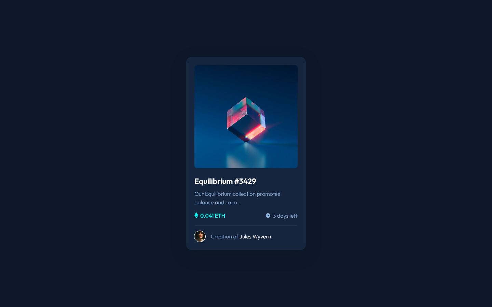
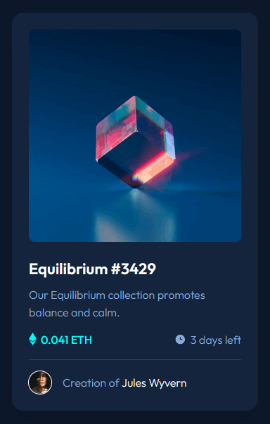

# Frontend Mentor - NFT preview card component

This is a solution to the challenge on [Frontend Mentor](https://www.frontendmentor.io/).
 
Frontend Mentor challenges help you improve your coding skills by building realistic projects.

 

## Table of contents
  - [Screenshots](#screenshots)
  - [Live site](#live-site)
  - [My process](#my-process)
    - [Built with](#built-with)
    - [What I learned](#what-i-learned)
  - [Author](#author)

 

## Screenshots

Desktop

 

Active states

 

## Live site

✨ You can interact with my solution on its dedicated [live site](https://isepec.github.io/nft-preview-card-component/).

 

## My process

### Built with

- Semantic HTML5 markup
- CSS custom properties
- Responsive design
- Flexbox

### What I learned

- As of writing this text, most browsers do not support using `::before` or `::after` on `` tags.
- An `` can't have a `position: relative` for an element with `position: absolute`, so we have to use a container.

 

## Author
- Github - [isepec](https://github.com/isepec)
- Frontend Mentor - [@isepec](https://www.frontendmentor.io/profile/isepec)